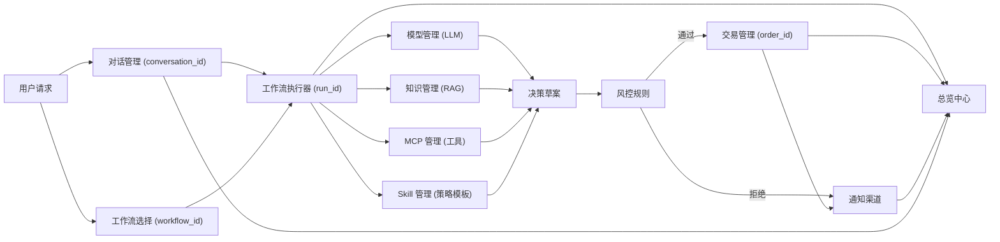
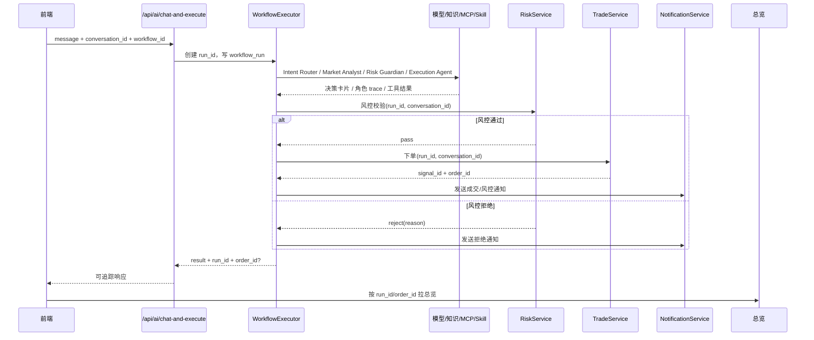
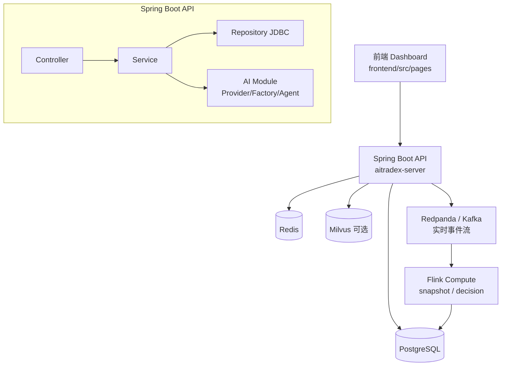

# AITradeX

> 一个面向交易场景的 AI 决策与执行中台。  
> 它把自然语言指令、Agent 协作、工作流编排、风控校验、下单执行和通知回传，串成一条可追踪、可治理、可回放的完整链路。


## 项目简介

AITradeX 不是一个“只会聊天”的交易助手，而是一套完整的交易控制台。

你可以把它理解成三层能力：

- 上层是交互层：用户通过自然语言发起分析、查询或交易请求。
- 中层是决策层：系统用多 Agent、工作流、知识库和工具能力生成结构化决策。
- 下层是执行层：风控校验通过后，系统进入下单、通知、监控和回放闭环。

这意味着它既能“看懂你要做什么”，也能“按规则把事情做完”，同时还能把整个过程记录清楚，方便复盘和审计。

## 适合什么场景

- 想把自然语言交易指令接入真实执行链路
- 想把 AI 分析、风控、下单和通知做成统一闭环
- 想用可视化工作流管理复杂交易流程
- 想把知识库、MCP 工具、Skill 和模型配置统一纳入后台管理
- 想让每次交易决策都有 trace、run_id、步骤记录和回放能力
- 想用一个更接近交易驾驶舱的界面，把系统状态、执行入口和辅助信息分清主次

## 核心能力

### 1. Agent-first 决策链

系统当前采用多 Agent 协作模式，而不是单一大 Prompt。

内置角色包括：

- `intent_router`：识别用户意图，决定本次任务该走哪条链路
- `market_analyst`：补齐行情、账户、上下文等事实信息
- `risk_guardian`：生成候选信号，并做无副作用风控预检
- `execution_agent`：在分析模式下输出建议，在执行模式下接入真实交易链
- `summary_agent`：把结构化结果整理成最终用户可读回复

每个阶段都会落库到 `workflow_run_step`，所以整条决策过程是可回放、可评估、可复盘的。

### 2. 工作流驱动执行

AITradeX 把“对话请求”和“工作流执行”打通：

- 请求进入系统后，会生成 `run_id`
- 工作流执行过程会写入 `workflow_run`
- 每一步 Agent 输出、工具调用和中间结果都会记录下来
- 最终结果可以回传到前端，也可以进入监控视图查看
- 工作流设计页以“流程清单”为主视图，先确认发布状态、版本和运行次数，再进入下方拓扑编辑
- 拓扑编辑工作台支持节点面板、画布、检查器、拓扑回显、撤销、自动排布和保存

这让系统从“AI 聊天结果”升级成“可管理的执行过程”。

### 3. 风控先行，不让 AI 直接裸奔下单

系统内置风控规则管理，并且把风控校验放在执行前。

当前已经支持：

- 数量限制
- 金额限制
- 做空限制
- 执行前拦截
- 分析模式无副作用预检
- 治理规则启停、编辑、删除、优先级排序
- 治理规则拖拽排序，拖动后会写回 `priority`

特别说明：

- `/api/admin/risk/*` 面向后台规则配置
- `/api/monitor/risk/rules` 面向运行时阈值快照
- `/api/admin/risk/rules/{id}/toggle` 使用 `enabled` query 参数，例如 `?enabled=false`

### 4. 实盘审批闸门

在实盘模式下，系统不会允许 `/api/ai/chat-and-execute` 直接下单。

必须走两段式流程：

1. 先用 `/api/ai/chat` 生成建议指令和决策卡片
2. 再用 `/api/ai/confirm-execute` 进行确认执行

确认执行时支持：

- `co_approver`
- `approval_passphrase`
- `approval_note`

这让实盘场景具备基本的人审闸门和审计上下文。

### 5. 可视化运营后台

前端后台已经覆盖以下核心模块：

- 总览中心
- 数据中心
- 工作流设计
- 交易管理（账户接入）
- 模型管理
- 知识管理
- 对话管理
- MCP 管理
- Skill 管理
- 通知渠道
- 治理控制台

它不是一个只展示指标的 Dashboard，而是一个可直接操作、可配置、可治理的控制台。

当前控制台的交互结构已经按“主工作区 + 轻折叠辅助区”重构：

- 总览中心：首屏聚焦交易指挥台，核心动作集中在交易模式、执行策略、交易指令、AI 分析和确认执行上
- 总览右侧：行情检索、多 Agent 协作链、Trace 与调试细节、系统摘要、今日优先事项和辅助信息默认折叠，并支持拖拽排序
- 数据中心：左侧保留实时观察、KPI 和主链路实时指标，右侧折叠承载分层健康、异常动作、实时执行流、热点标的和质量评分
- 其它管理模块：统一为一个完整工作台容器，左侧放主列表或主配置，右侧放轻折叠辅助信息和模块操作
- 工作流设计：上方是流程清单，下方是拓扑编辑工作台，流程操作和节点明细收进编辑区底部的辅助信息
- 治理控制台：主区聚焦治理规则明细，右侧承载治理概览、优先事项、观察日志和模块操作，规则表支持排序与拖拽调整优先级

这些改造的目标是让页面先回答“当前能不能执行”，再回答“下一步应该做什么”，最后才展开低频细节。

## 一条主链路怎么跑

下面这张图可以帮助快速理解系统：



如果你想看一次执行从前端到下单再到通知的完整时序，可以看下面这张图：



## 技术架构



数据中心会通过 `/api/monitor/*` 读取订单、风控、工作流、质量评分和 Flink 指标，把实时链路压缩成可观察的驾驶舱视图。Flink 本地运行说明见 `infra/flink/README.md`。

## 快速开始

### 环境要求

- JDK 17+
- Maven 3.8+
- Docker + Docker Compose
- 可选：Milvus（只有在文档解析并向量化入库时才需要）

### 方案一：Docker Compose 一键启动

这是最省心的启动方式。

```bash
cp .env.example .env
docker compose up --build -d
```

启动后访问：

```text
http://localhost:8000/
```

如果你在构建时遇到 Docker Hub 拉取超时，例如 `failed to fetch anonymous token`，建议先改用“方案二”本地运行 API。

### 方案二：本地运行 API，数据库走 Docker

```bash
cp .env.example .env
docker compose up -d postgres redis

cd aitradex-server
mvn clean package -DskipTests
java -jar target/aitradex-java-1.0.0.jar
```

健康检查：

```bash
curl http://localhost:8000/api/system/health
```

## 推荐使用顺序

第一次接触项目时，建议按下面顺序体验：

1. 先启动系统，打开控制台确认页面能正常加载
2. 在“总览中心”的交易指挥台确认交易模式、执行策略和主操作入口
3. 在“模型管理”里配置模型供应商和 API Key
4. 在“交易管理”里确认当前交易模式和可用账户
5. 在“治理控制台”里检查风控规则是否启用，并按优先级排序或拖拽调整规则顺序
6. 在“工作流设计”里先看流程清单，再进入下方拓扑编辑确认节点和连线
7. 回到首页交易指挥台发起 AI 分析、确认执行或运行回放
8. 在“数据中心”观察吞吐、延迟、异常事件、实时执行流和 Agent 质量评分

这样更容易把系统理解成一条链，而不是一堆功能菜单。

## 执行链路校验

项目自带一份校验脚本：

```text
scripts/verify_execution_chain.sh
```

它会做这些事：

- 自动登录（默认 `admin/admin123`，也可以传 `JWT_TOKEN`）
- 调用 `/api/ai/chat-and-execute`
- 根据 `run_id` 检查 `workflow_run`
- 检查 `workflow_run_step`
- 检查 `strategy_signal`
- 检查 `trade_order`
- 检查 `risk_check_log`

基础用法：

```bash
scripts/verify_execution_chain.sh
```

严格校验：

```bash
STRICT_TRADE=1 scripts/verify_execution_chain.sh
```

指定消息和环境：

```bash
CHAT_MESSAGE="请执行交易命令：买入 000001 100" \
API_BASE_URL="http://localhost:8000" \
scripts/verify_execution_chain.sh
```

注意：

- 当前版本在实盘模式下，会拦截 `/api/ai/chat-and-execute`
- 如果你要验证“自动执行链路”，请先切到 `paper` 模式
- 如果你要验证实盘链路，请使用 `/api/ai/chat` + `/api/ai/confirm-execute`

## 实盘审批链路验证

下面是一套最直接的验证方式。

### 第一步：登录拿 token

```bash
TOKEN=$(curl -sS -X POST "http://localhost:8000/api/auth/login" \
  -H "Content-Type: application/json" \
  -d '{"username":"admin","password":"admin123"}' | jq -r '.data.access_token')
```

### 第二步：直接执行会被拦截

预期结果是返回 `approval_required=true`。

```bash
curl -sS -X POST "http://localhost:8000/api/ai/chat-and-execute" \
  -H "Authorization: Bearer $TOKEN" \
  -H "Content-Type: application/json" \
  -d '{"message":"买入 600519 100 股","conversation_id":1,"workflow_id":1}'
```

### 第三步：通过确认执行接口放行

注意这里传的是 `command`，不是 `message`。

```bash
curl -sS -X POST "http://localhost:8000/api/ai/confirm-execute" \
  -H "Authorization: Bearer $TOKEN" \
  -H "Content-Type: application/json" \
  -d '{"command":"买入 600519 100 股","conversation_id":1,"workflow_id":1,"co_approver":"ops-user","approval_passphrase":"your-passphrase","approval_note":"manual approval"}'
```

补充说明：

- 如果没有配置 `APP_EXECUTION_APPROVAL_PASSPHRASE`，第三步返回“审批口令未配置”是正常行为
- 生产环境建议强制配置审批口令，并保留完整审计记录

## 当前实现状态

当前版本已经具备一条完整的交易主链，重点包括：

- 多 Agent 决策编排已经接入真实执行入口
- `FinancialAgentService` 已作为薄入口转发到 `TradingDecisionOrchestrator`
- 工作流定义、节点编辑和拓扑存储已经落地
- Agent 质量评分接口已提供成功率、风控拒绝率、平均延迟和 P95 延迟
- 知识文档在 `trigger_parse=true` 时可以写入 Milvus
- 通知渠道已支持飞书、企业微信 Webhook
- 首页已经重构为交易指挥台优先，右侧辅助信息默认折叠并支持拖拽排序
- 数据中心已经重构为左侧实时主视图、右侧轻折叠观察列
- 工作流设计已经重构为“流程清单在上、拓扑编辑在下”的主链路布局
- 治理规则明细支持排序、拖拽调整优先级、启用/禁用和自动刷新统计

换句话说，现在的项目已经不是 Demo，而是一套可运行、可管理、可持续扩展的基础平台。

## 下一阶段最值得做的事

如果继续往“真正的 Agent 化交易系统”演进，优先级最高的方向建议是：

- 组合级记忆：不仅看本次请求，也看当前持仓、近几次决策、失败原因和滑点表现
- 更完整的人审链路：支持权限分级、超时、撤销和双签审计
- Research Agent：接入新闻、公告、财报和宏观事件
- Portfolio Agent：从单笔交易判断升级为组合级仓位管理
- Post-trade Review Agent：对每次执行做复盘和归因
- Model Routing：不同 Agent 使用不同模型和参数

## 关键配置

主要环境变量见 `.env.example` 和 `aitradex-server/src/main/resources/application.yml`。

下面是最常用的一组：

| 变量 | 默认值 | 说明 |
|---|---|---|
| `APP_HOST` | `0.0.0.0` | 服务监听地址 |
| `APP_PORT` | `8000` | 服务端口 |
| `JDBC_DATABASE_URL` | `jdbc:postgresql://localhost:5432/aibuy` | PostgreSQL 地址 |
| `POSTGRES_USER` | `aibuy` | 数据库用户名 |
| `POSTGRES_PASSWORD` | `aibuy` | 数据库密码 |
| `REDIS_URL` | `redis://localhost:6379/0` | Redis 地址 |
| `BROKER_MODE` | `paper` | 默认交易模式 |
| `RISK_MAX_QTY` | `100000` | 风控最大数量 |
| `RISK_MAX_NOTIONAL` | `2000000` | 风控最大金额 |
| `RISK_ALLOW_SHORT` | `false` | 是否允许做空 |
| `APP_EXECUTION_APPROVAL_PASSPHRASE` | 空 | 实盘审批口令 |
| `OPENAI_API_KEY` | 空 | OpenAI API Key |
| `OPENAI_BASE_URL` | 空 | OpenAI Base URL |
| `MINIMAX_API_KEY` | 空 | MiniMax API Key |
| `MINIMAX_BASE_URL` | `https://api.minimaxi.com/v1` | MiniMax Base URL |
| `KNOWLEDGE_MILVUS_HOST` | `localhost` | Milvus 主机 |
| `KNOWLEDGE_MILVUS_PORT` | `19530` | Milvus 端口 |
| `STREAM_ENABLED` | `false` | 是否发布实时事件流 |
| `STREAM_BOOTSTRAP_SERVERS` | `redpanda:9092` | Kafka/Redpanda 地址 |
| `STREAM_INGEST_TOKEN` | 空 | 外部行情写入令牌 |
| `FLINK_COMPUTE_ENABLED` | `true` | 是否启用 Flink 指标读取 |
| `FLINK_COMPUTE_ENGINE` | `snapshot` | 实时计算模式，支持 `snapshot` / `decision` |
| `FLINK_DECISION_WINDOW_SEC` | `30` | 决策信号计算窗口 |
| `FLINK_DECISION_UP_BPS` | `18` | 上涨触发阈值 |
| `FLINK_DECISION_DOWN_BPS` | `18` | 下跌触发阈值 |

## 目录结构

```text
AITradeX/
├── aitradex-server/                # Spring Boot 后端
│   ├── src/main/java/com/
│   │   ├── controller/             # API 入口
│   │   ├── service/                # 核心业务逻辑
│   │   ├── repository/             # JDBC 数据访问
│   │   ├── ai/                     # Provider / Factory / Agent / AI Service
│   │   ├── domain/                 # 请求、响应、实体模型
│   │   ├── config/                 # 配置与拦截器
│   │   ├── common/                 # 通用响应与异常
│   │   └── system/                 # 系统管理相关服务
│   └── src/main/resources/
│       ├── application.yml
│       └── logback-spring.xml
├── flink-compute/                  # Flink 实时计算任务
├── frontend/src/pages/             # login / register / dashboard 页面
├── infra/flink/                    # Flink / Redpanda 本地运行说明
├── infra/postgres/init/            # PostgreSQL 初始化脚本
├── scripts/                        # 辅助校验脚本
├── docker-compose.yml
├── docker-compose.flink.yml
├── .env.example
└── README.md
```

## API 概览

统一前缀：`/api`

### 认证与系统

| 方法 | 路径 | 说明 |
|---|---|---|
| `POST` | `/auth/login` | 登录 |
| `POST` | `/auth/register` | 注册 |
| `POST` | `/auth/logout` | 退出 |
| `GET` | `/auth/userinfo` | 当前用户信息 |
| `GET` | `/system/health` | 系统健康检查 |

### 交易接入

| 方法 | 路径 | 说明 |
|---|---|---|
| `GET` | `/broker/mode` | 当前券商模式 |
| `POST` | `/broker/switch` | 切换券商模式 |
| `POST` | `/broker/accounts` | 创建账户 |
| `GET` | `/broker/accounts` | 账户列表 |
| `POST` | `/broker/accounts/{accountId}/activate` | 激活账户 |
| `GET` | `/broker/accounts/active` | 当前激活账户 |
| `GET` | `/broker/okx/real-data` | OKX 实盘数据 |
| `GET` | `/broker/okx/portfolio` | OKX 持仓快照 |

### 行情

| 方法 | 路径 | 说明 |
|---|---|---|
| `GET` | `/market/quote/search` | 标的检索，需要 `q` 和 `market` |
| `GET` | `/market/quote/{symbol}` | 单标的行情 |
| `GET` | `/market/kline/{symbol}` | K 线数据 |
| `POST` | `/market/bars/import-csv` | 导入 CSV 行情 |
| `POST` | `/market/bars/simulate` | 生成模拟行情 |

支持的 `market`：

- `cn_stock`
- `cn_convertible`
- `crypto`
- `futures`
- `hk_stock`
- `us_stock`

### 交易与回测

| 方法 | 路径 | 说明 |
|---|---|---|
| `POST` | `/trade/signals` | 直接提交交易信号 |
| `GET` | `/trade/orders/{orderId}` | 查询订单详情 |
| `POST` | `/trade/trade/command` | 自然语言交易指令解析或执行 |
| `POST` | `/trade/strategy/run` | 执行策略并尝试下单 |
| `POST` | `/trade/backtest/sma` | SMA 回测 |
| `GET` | `/trade/backtest/reports` | 回测报告列表 |

### AI

| 方法 | 路径 | 说明 |
|---|---|---|
| `GET` | `/ai/models` | 供应商和模型目录 |
| `GET` | `/ai/config` | 当前模型配置 |
| `GET` | `/ai/saved-configs` | 已保存配置 |
| `POST` | `/ai/config` | 保存模型配置 |
| `DELETE` | `/ai/config` | 清空当前配置 |
| `POST` | `/ai/test` | 连通性测试 |
| `POST` | `/ai/switch-model` | 切换模型 |
| `POST` | `/ai/chat` | AI 分析，不执行 |
| `POST` | `/ai/simple-chat` | 简单聊天 |
| `POST` | `/ai/chat-and-execute` | AI 分析并执行 |
| `POST` | `/ai/confirm-execute` | 审批后确认执行 |

### 监控与回放

| 方法 | 路径 | 说明 |
|---|---|---|
| `GET` | `/monitor/summary` | 监控摘要 |
| `GET` | `/monitor/orders` | 订单分页 |
| `GET` | `/monitor/risk/rules` | 运行时风控阈值快照 |
| `GET` | `/monitor/workflow-runs` | 工作流运行记录 |
| `GET` | `/monitor/workflow-runs/{runId}` | 指定 `run_id` 的回放详情 |
| `GET` | `/monitor/workflow-quality` | Agent 质量评分与趋势 |
| `GET` | `/monitor/flink/metrics` | Flink 实时计算指标 |
| `GET` | `/monitor/flink/decision-signals` | Flink 低延迟决策信号 |

### 管理后台

| 方法 | 路径 | 说明 |
|---|---|---|
| `GET` | `/admin/knowledge/stats` | 知识统计 |
| `GET/POST` | `/admin/knowledge/bases` | 知识库列表与创建 |
| `PUT/DELETE` | `/admin/knowledge/bases/{id}` | 知识库更新与删除 |
| `GET/POST` | `/admin/knowledge/documents` | 文档列表与创建 |
| `GET/POST` | `/admin/conversations` | 对话列表与创建 |
| `PUT/DELETE` | `/admin/conversations/{id}` | 对话更新与删除 |
| `GET` | `/admin/conversations/insights` | 对话洞察 |
| `GET/POST` | `/admin/mcp/tools` | MCP 工具列表与创建 |
| `PUT/DELETE` | `/admin/mcp/tools/{id}` | MCP 工具更新与删除 |
| `GET/POST` | `/admin/mcp/markets` | MCP 市场列表与创建 |
| `PUT/DELETE` | `/admin/mcp/markets/{id}` | MCP 市场更新与删除 |
| `GET/POST` | `/admin/workflows` | 工作流列表与创建 |
| `PUT/DELETE` | `/admin/workflows/{id}` | 工作流更新与删除 |
| `GET` | `/admin/workflows/nodes` | 工作流节点列表 |
| `GET/PUT` | `/admin/workflows/{id}/graph` | 工作流拓扑读取与保存 |
| `GET/POST` | `/admin/skills` | Skill 列表与创建 |
| `GET/PUT/DELETE` | `/admin/skills/{id}` | Skill 详情、更新、删除 |
| `GET` | `/admin/skills/{id}/detail` | Skill 聚合详情 |
| `GET/PUT` | `/admin/skills/{id}/prompt` | Skill Prompt 读写 |
| `GET/PUT` | `/admin/skills/{id}/script` | Skill Script 读写 |
| `GET/POST` | `/admin/notification-channels` | 通知渠道列表与创建 |
| `GET/PUT/DELETE` | `/admin/notification-channels/{id}` | 通知渠道详情、更新、删除 |
| `GET/POST` | `/admin/risk/rules` | 风控规则列表与创建 |
| `GET/PUT/DELETE` | `/admin/risk/rules/{id}` | 风控规则详情、更新、删除 |
| `PUT` | `/admin/risk/rules/{id}/toggle?enabled=true|false` | 风控规则启停 |

## 核心数据模型

按业务域划分，当前最重要的表包括：

- 交易域：`strategy_signal`、`trade_order`、`trade_fill`、`position_snapshot`、`account_snapshot`
- 风控域：`risk_rule`、`risk_check_log`
- AI 配置：`ai_config`
- 工作流域：`workflow_definition`、`workflow_node_definition`
- 知识域：`knowledge_base`、`knowledge_document`
- 对话域：`conversation_session`
- 工具域：`mcp_tool`、`mcp_market`、`skill`
- 系统域：`notification_channel`、`broker_account`、`system_setting`、`sys_user`

## 开发与排障

### 常用命令

```bash
cd aitradex-server

# 编译
mvn clean package -DskipTests

# 本地运行
java -jar target/aitradex-java-1.0.0.jar

# 查看日志
tail -f logs/aitradex.log
tail -f logs/aitradex-error.log
```

### 常见问题

| 问题 | 优先检查 |
|---|---|
| 无法登录 | `JWT_SECRET`、用户表初始化、浏览器 token |
| 行情检索失败 | `market` 参数、标的代码格式 |
| AI 无响应 | 模型配置、API Key、Base URL |
| 文档解析失败 | `trigger_parse=true` 时 Milvus 是否可用 |
| 通知未发送 | 渠道是否 `enabled=true`，Webhook 是否有效 |
| 执行被拦截 | 当前是否为实盘模式，是否进入审批链路 |
| 治理规则启停失败 | 前端请求是否带 `?enabled=true|false`，后端是否读取 `@RequestParam enabled` |
| 治理规则拖拽后未保存 | 检查 `/api/admin/risk/rules/{id}` 更新接口和 `priority` 是否写入成功 |
| 工作流画布未回显 | 检查 `/api/admin/workflows/{id}/graph`，并确认流程清单里已选中有效流程 |

## 技术栈

| 层级 | 技术 |
|---|---|
| 后端 | Spring Boot 3.3.5 + Java 17 |
| 构建 | Maven |
| 数据库 | PostgreSQL 16 |
| 缓存 | Redis 7 |
| 向量库 | Milvus 2.x（可选） |
| 实时计算 | Flink + Redpanda/Kafka |
| AI | LangChain4j |
| 前端 | HTML / CSS / Vanilla JS |
| 部署 | Docker Compose |

## License

MIT License
