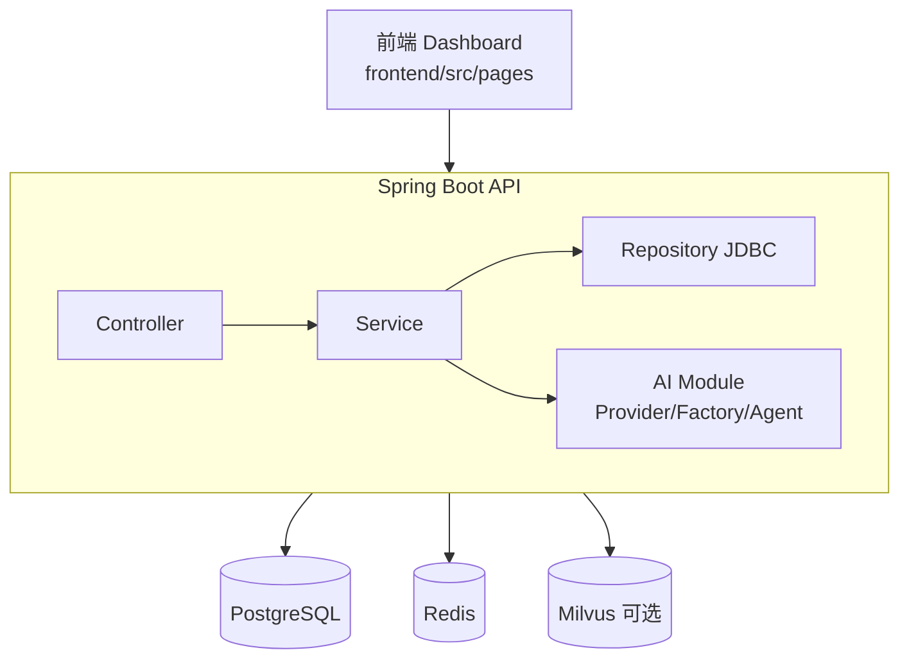
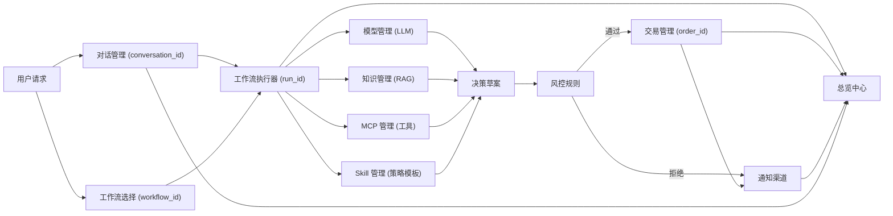
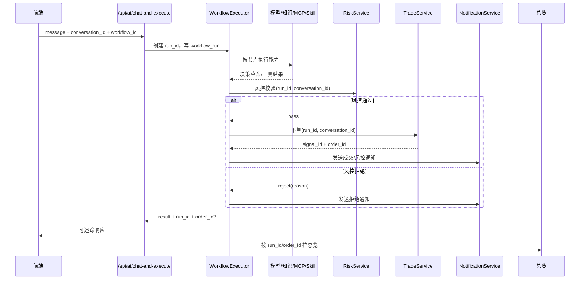

# AITradeX Java Edition

AITradeX 是一个基于 `Agent + Workflow + RAG` 的 AI 量化交易决策系统，提供从自然语言请求到风控校验、下单执行、通知回传、监控总览的闭环能力。


## 项目定位

- 面向交易场景的 AI 助手与执行中台
- 支持模型管理、知识库、MCP 工具、Skill、工作流可视化编排
- 支持纸面交易与多券商模式统一接入
- 支持风控规则管理与执行前拦截

## 核心特性

- FinancialAgent 多轮规划与工具调用
- 工作流图可视化编排与拓扑持久化
- 行情检索支持 A 股、可转债、港股、美股、期货、区块链
- 交易链路完整：信号 -> 风控 -> 订单 -> 成交 -> 持仓/账户快照
- 知识文档解析 + 向量化写入（Milvus）
- 通知渠道（飞书/企业微信 Webhook）

## 系统架构

### 技术架构图



### 模块总图



### 一次执行时序



## 当前实现说明

- 工作流模块当前已实现定义管理、节点拓扑编辑与存储。
- AI 执行入口已基于 FinancialAgent 实现多轮规划与工具调用。
- 知识文档 `trigger_parse=true` 时会尝试写入 Milvus；未启用解析时不依赖 Milvus。
- 风控存在两套视角：
  - `/api/admin/risk/*`：规则配置管理（`risk_rule` 表）
  - `/api/monitor/risk/rules`：运行时阈值快照（来自 `app.*` 配置）

## 功能模块（与前端侧边栏对应）

- 总览中心：系统状态、订单与资产摘要
- 业务流程：工作流、交易管理
- AI 核心：模型管理、对话管理
- 知识与工具：知识库、MCP、Skill
- 系统管理：通知渠道、风控规则

## 快速开始

### 前置要求

- JDK 17+
- Maven 3.8+
- Docker + Docker Compose
- 可选：Milvus（仅在文档解析入库时需要）

### 方式一：Docker Compose 一键启动

```bash
cp .env.example .env
docker compose up --build -d
```

访问地址：`http://localhost:8000/`

### 方式二：本地运行 API（依赖 Docker 数据库）

```bash
cp .env.example .env

docker compose up -d postgres redis

cd aitradex-server
mvn clean package -DskipTests
java -jar target/aitradex-java-1.0.0.jar
```

健康检查：

```bash
curl http://localhost:8000/api/system/health
```

## 配置说明

主要环境变量（见 `.env.example` 与 `application.yml`）：

| 变量 | 默认值 | 说明 |
|---|---|---|
| `APP_HOST` | `0.0.0.0` | 服务监听地址 |
| `APP_PORT` | `8000` | 服务端口 |
| `JDBC_DATABASE_URL` | `jdbc:postgresql://localhost:5432/aibuy` | PostgreSQL JDBC 地址 |
| `POSTGRES_USER` | `aibuy` | 数据库用户 |
| `POSTGRES_PASSWORD` | `aibuy` | 数据库密码 |
| `REDIS_URL` | `redis://localhost:6379/0` | Redis 连接地址 |
| `BROKER_MODE` | `paper` | 默认券商模式 |
| `RISK_MAX_QTY` | `100000` | 风控：最大数量 |
| `RISK_MAX_NOTIONAL` | `2000000` | 风控：最大金额 |
| `RISK_ALLOW_SHORT` | `false` | 风控：是否允许做空 |
| `OPENAI_API_KEY` | 空 | OpenAI API Key |
| `OPENAI_BASE_URL` | 空 | OpenAI Base URL |
| `MINIMAX_API_KEY` | 空 | MiniMax API Key |
| `MINIMAX_BASE_URL` | `https://api.minimaxi.com/v1` | MiniMax Base URL |
| `KNOWLEDGE_MILVUS_HOST` | `localhost` | Milvus 主机 |
| `KNOWLEDGE_MILVUS_PORT` | `19530` | Milvus 端口 |

## 目录结构

```text
AITradeX/
├── aitradex-server/                # Spring Boot 后端
│   ├── src/main/java/com/
│   │   ├── controller/             # API 路由层
│   │   ├── service/                # 业务逻辑层
│   │   ├── repository/             # JDBC 数据访问层
│   │   ├── ai/                     # AI Provider/Factory/Agent
│   │   ├── domain/                 # DTO / Entity
│   │   ├── config/                 # 配置与拦截器
│   │   └── common/                 # 统一响应、异常处理
│   └── src/main/resources/
│       └── application.yml
├── frontend/src/pages/             # login/register/dashboard 页面
├── infra/postgres/init/            # PostgreSQL 初始化脚本
├── docker-compose.yml
├── .env.example
└── README.md
```

## API 总览（按模块）

统一前缀：`/api`

### 认证与系统

| 方法 | 路径 | 说明 |
|---|---|---|
| `POST` | `/auth/login` | 登录 |
| `POST` | `/auth/register` | 注册 |
| `POST` | `/auth/logout` | 退出 |
| `GET` | `/auth/userinfo` | 当前用户信息 |
| `GET` | `/system/health` | 系统健康检查 |

### 券商与账户

| 方法 | 路径 | 说明 |
|---|---|---|
| `GET` | `/broker/mode` | 当前券商模式 |
| `POST` | `/broker/switch` | 切换券商模式 |
| `POST` | `/broker/accounts` | 创建账户 |
| `GET` | `/broker/accounts` | 账户列表 |
| `POST` | `/broker/accounts/{accountId}/activate` | 激活账户 |
| `GET` | `/broker/accounts/active` | 当前激活账户 |
| `GET` | `/broker/okx/real-data` | OKX 实盘数据 |
| `GET` | `/broker/okx/portfolio` | OKX 持仓快照 |

### 行情

| 方法 | 路径 | 说明 |
|---|---|---|
| `GET` | `/market/quote/search` | 标的检索（需 `q`、`market`） |
| `GET` | `/market/quote/{symbol}` | 单标的行情 |
| `GET` | `/market/kline/{symbol}` | K 线数据 |
| `POST` | `/market/bars/import-csv` | 导入 CSV 行情 |
| `POST` | `/market/bars/simulate` | 生成模拟行情 |

`market` 支持值：`cn_stock`、`cn_convertible`、`crypto`、`futures`、`hk_stock`、`us_stock`

### 交易与回测

| 方法 | 路径 | 说明 |
|---|---|---|
| `POST` | `/trade/signals` | 直接提交交易信号 |
| `GET` | `/trade/orders/{orderId}` | 查询订单详情 |
| `POST` | `/trade/trade/command` | 自然语言交易指令解析/执行 |
| `POST` | `/trade/strategy/run` | 执行策略并尝试下单 |
| `POST` | `/trade/backtest/sma` | SMA 回测 |
| `GET` | `/trade/backtest/reports` | 回测报告列表 |

### 监控

| 方法 | 路径 | 说明 |
|---|---|---|
| `GET` | `/monitor/summary` | 监控摘要 |
| `GET` | `/monitor/orders` | 订单分页 |
| `GET` | `/monitor/risk/rules` | 运行时风控阈值快照 |

### AI

| 方法 | 路径 | 说明 |
|---|---|---|
| `GET` | `/ai/models` | 供应商/模型目录 |
| `GET` | `/ai/config` | 当前配置 |
| `GET` | `/ai/saved-configs` | 已保存配置 |
| `POST` | `/ai/config` | 保存模型配置 |
| `DELETE` | `/ai/config` | 清空当前配置 |
| `POST` | `/ai/test` | 连通性测试 |
| `POST` | `/ai/switch-model` | 切换模型 |
| `POST` | `/ai/chat` | AI 分析（不执行） |
| `POST` | `/ai/simple-chat` | 简单聊天 |
| `POST` | `/ai/chat-and-execute` | AI 分析并执行 |

### 管理后台（知识、对话、MCP、工作流、Skill、通知）

| 方法 | 路径 | 说明 |
|---|---|---|
| `GET` | `/admin/knowledge/stats` | 知识统计 |
| `GET/POST` | `/admin/knowledge/bases` | 知识库列表/创建 |
| `PUT/DELETE` | `/admin/knowledge/bases/{id}` | 知识库更新/删除 |
| `GET/POST` | `/admin/knowledge/documents` | 文档列表/创建 |
| `GET/POST` | `/admin/conversations` | 对话列表/创建 |
| `PUT/DELETE` | `/admin/conversations/{id}` | 对话更新/删除 |
| `GET` | `/admin/conversations/insights` | 对话洞察 |
| `GET/POST` | `/admin/mcp/tools` | MCP 工具列表/创建 |
| `PUT/DELETE` | `/admin/mcp/tools/{id}` | MCP 工具更新/删除 |
| `GET/POST` | `/admin/mcp/markets` | MCP 市场列表/创建 |
| `PUT/DELETE` | `/admin/mcp/markets/{id}` | MCP 市场更新/删除 |
| `GET/POST` | `/admin/workflows` | 工作流列表/创建 |
| `PUT/DELETE` | `/admin/workflows/{id}` | 工作流更新/删除 |
| `GET` | `/admin/workflows/nodes` | 工作流节点列表 |
| `GET/PUT` | `/admin/workflows/{id}/graph` | 工作流拓扑读取/保存 |
| `GET/POST` | `/admin/skills` | Skill 列表/创建 |
| `GET/PUT/DELETE` | `/admin/skills/{id}` | Skill 详情/更新/删除 |
| `GET` | `/admin/skills/{id}/detail` | Skill 聚合详情 |
| `GET/PUT` | `/admin/skills/{id}/prompt` | Skill Prompt 读写 |
| `GET/PUT` | `/admin/skills/{id}/script` | Skill Script 读写 |
| `GET/POST` | `/admin/notification-channels` | 通知渠道列表/创建 |
| `GET/PUT/DELETE` | `/admin/notification-channels/{id}` | 通知渠道详情/更新/删除 |

### 风控规则管理

| 方法 | 路径 | 说明 |
|---|---|---|
| `GET` | `/admin/risk/rules` | 风控规则列表 |
| `GET` | `/admin/risk/rules/{id}` | 风控规则详情 |
| `POST` | `/admin/risk/rules` | 创建风控规则 |
| `PUT` | `/admin/risk/rules/{id}` | 更新风控规则 |
| `PUT` | `/admin/risk/rules/{id}/toggle?enabled=true|false` | 启停规则 |
| `DELETE` | `/admin/risk/rules/{id}` | 删除规则 |

## 数据模型（核心表）

- 交易域：`strategy_signal`、`trade_order`、`trade_fill`、`position_snapshot`、`account_snapshot`
- 风控域：`risk_rule`、`risk_check_log`
- AI 配置：`ai_config`
- 工作流域：`workflow_definition`、`workflow_node_definition`
- 知识域：`knowledge_base`、`knowledge_document`
- 对话域：`conversation_session`
- 工具域：`mcp_tool`、`mcp_market`、`skill`
- 系统域：`notification_channel`、`broker_account`、`system_setting`、`sys_user`

## 开发与排障

### 常用命令

```bash
# 编译
cd aitradex-server
mvn clean package -DskipTests

# 本地运行
java -jar target/aitradex-java-1.0.0.jar

# 查看日志
tail -f aitradex-server/logs/aitradex.log
tail -f aitradex-server/logs/aitradex-error.log
```

### 典型检查点

- 无法登录：检查 `JWT_SECRET`、数据库用户表初始化与浏览器 token
- 行情检索失败：确认 `market` 参数与标的代码格式
- AI 无响应：确认模型配置与 API Key
- 文档解析失败：`trigger_parse=true` 时确认 Milvus 可用
- 通知未发送：确认渠道 `enabled=true` 且 webhook 配置有效

## 技术栈

| 层级 | 技术 |
|---|---|
| 后端 | Spring Boot 3.3.5 + Java 17 |
| 构建 | Maven |
| 数据库 | PostgreSQL 16 |
| 缓存 | Redis 7 |
| 向量库 | Milvus 2.x（可选） |
| AI | LangChain4j |
| 前端 | HTML/CSS/Vanilla JS |
| 部署 | Docker Compose |

## License

MIT License
