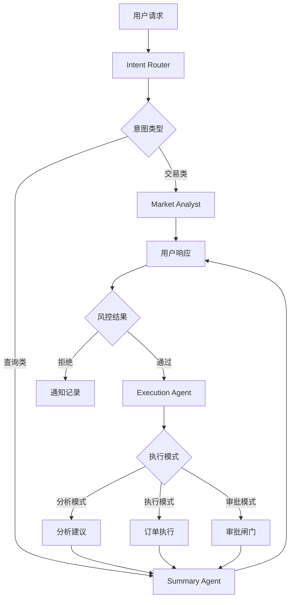
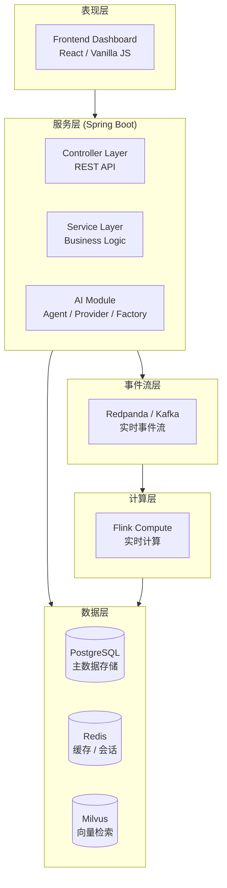
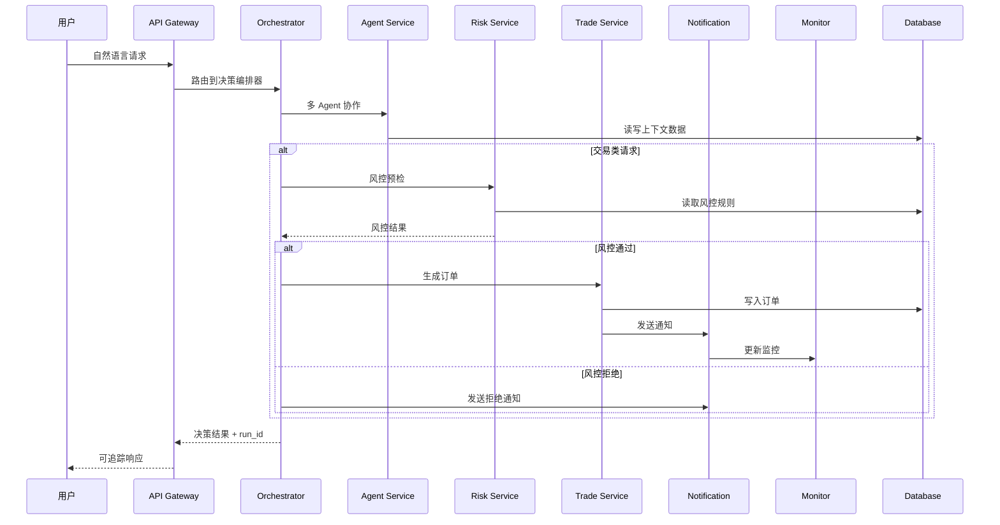
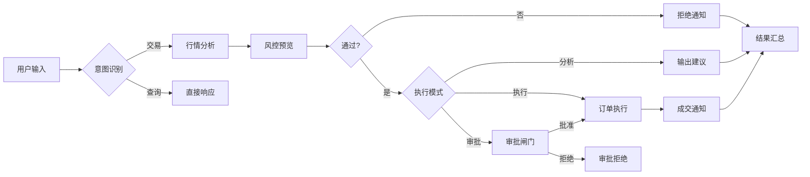

# AITradeX - AI 驱动的智能交易决策与执行平台

> 将自然语言指令、多 Agent 协作、工作流编排、风险控制、订单执行和实时通知整合为可追踪、可治理、可审计的完整闭环。


---

## 目录

1. [系统概述](#1-系统概述)
2. [核心能力](#2-核心能力)
3. [技术架构](#3-技术架构)
4. [业务流程](#4-业务流程)
5. [部署指南](#5-部署指南)
6. [快速开始](#6-快速开始)
7. [运营指南](#7-运营指南)
8. [系统验证](#8-系统验证)
9. [运维监控](#9-运维监控)
10. [安全合规](#10-安全合规)
11. [配置参考](#11-配置参考)
12. [目录结构](#12-目录结构)
13. [API 参考](#13-api-参考)
14. [数据模型](#14-数据模型)
15. [故障排查](#15-故障排查)
16. [术语表](#16-术语表)

---

## 1. 系统概述

### 1.1 项目定位

AITradeX 是面向量化交易场景的**企业级 AI 决策与执行平台**，区别于普通的对话式交易助手，本系统具备以下核心特征：

| 特性 | 传统聊天机器人 | AITradeX |
|------|---------------|----------|
| 决策方式 | 单一大模型推理 | 多 Agent 协作编排 |
| 执行能力 | 仅提供建议 | 可直接接入交易链路 |
| 风控机制 | 无或简单规则 | 多层级、可配置的风控引擎 |
| 可追溯性 | 不可追溯 | 全链路执行追踪与回放 |
| 审批流程 | 无 | 两段式审批闸门 |
| 运维能力 | 黑盒 | 完整的可观测性与监控 |

### 1.2 系统价值

```
┌─────────────────────────────────────────────────────────────────────┐
│                         AITradeX 价值矩阵                           │
├─────────────────────────────────────────────────────────────────────┤
│                                                                     │
│  • 提升决策效率：将自然语言转换为可执行交易指令，消除手工操作          │
│                                                                     │
│  • 强化风险控制：前置风控校验，防止失控交易和流动性风险               │
│                                                                     │
│  • 保障合规审计：全链路留痕，支持事后追溯和监管报送                  │
│                                                                     │
│  • 沉淀交易知识：整合知识库与历史案例，形成机构级决策能力             │
│                                                                     │
│  • 优化运营体验：可视化控制台，降低交易团队学习成本                  │
│                                                                     │
└─────────────────────────────────────────────────────────────────────┘
```

### 1.3 适用场景

| 场景类别 | 详细描述 |
|---------|----------|
| **智能交易执行** | 将自然语言交易指令（"买入 100 股茅台"）转换为结构化订单 |
| **量化策略运营** | 可视化管理复杂交易策略，实时监控执行效果 |
| **AI 分析闭环** | 整合市场分析、信号生成、风险评估和订单执行 |
| **工作流自动化** | 通过可视化编辑器编排多步骤交易流程 |
| **知识驱动的决策** | 基于机构知识库（研报、规则、案例）进行合规判断 |
| **实时监控运营** | 统一驾驶舱视图，实时掌握系统状态和交易动态 |

### 1.4 技术特点

- **多 Agent 协作架构**：职责分离，协同决策
- **规则引擎驱动**：可配置、可扩展的风控体系
- **事件流架构**：基于 Redpanda/Kafka 的实时事件处理
- **Flink 实时计算**：毫秒级延迟的行情计算和信号决策
- **全链路可观测**：完整的 Trace、Run ID 和执行回放能力
- **企业级安全**：JWT 认证、审批闸门、审计日志

---

## 2. 核心能力

### 2.1 多 Agent 决策引擎

系统采用**多 Agent 协作模式**，每个 Agent 承担特定职责，形成完整的决策流水线：

#### 2.1.1 Agent 角色定义

| Agent 角色 | 职责 | 输入 | 输出 |
|-----------|------|------|------|
| **Intent Router** | 意图识别与路由 | 用户自然语言请求 | 结构化意图分类（category, symbol, side, quantity） |
| **Market Analyst** | 市场信息聚合 | 意图 + 上下文 | 实时行情、K 线趋势、市场情绪 |
| **Risk Guardian** | 风险评估与预览 | 交易信号候选 | 风控检查结果、建议信号 |
| **Execution Agent** | 执行决策 | 风控结果 | 订单指令或执行建议 |
| **Summary Agent** | 响应生成 | 全链路结果 | 用户友好的自然语言回复 |

#### 2.1.2 Agent 协作流程



#### 2.1.3 决策链路特性

- **可追踪**：每个 Agent 输出都会记录到 `workflow_run_step` 表
- **可回放**：基于 `run_id` 可完整回放决策过程
- **可评估**：记录执行耗时、Token 消耗和输出质量
- **可干预**：支持在任一环节人工介入

### 2.2 工作流驱动执行

#### 2.2.1 工作流架构

```
┌─────────────────────────────────────────────────────────────┐
│                    Workflow Execution Layer                  │
├─────────────────────────────────────────────────────────────┤
│                                                             │
│  Request → WorkflowDefinition → WorkflowNode → Execution   │
│      │              │                   │           │       │
│      │              │                   │           │       │
│   run_id      workflow_id          node_id    执行结果     │
│                                                             │
└─────────────────────────────────────────────────────────────┘
```

#### 2.2.2 工作流核心特性

| 特性 | 说明 |
|------|------|
| **流程清单管理** | 支持流程版本控制、发布状态管理、执行统计 |
| **可视化拓扑编辑** | 节点面板、画布拖拽、连线路由、自动排布 |
| **检查器面板** | 节点属性配置、参数映射、错误提示 |
| **版本控制** | 支持保存、回退和历史版本对比 |
| **执行追踪** | 每步执行记录、中间结果、全链路 Trace |

#### 2.2.3 预置工作流节点类型

- **LLM 节点**：调用大模型进行推理
- **知识检索节点**：基于向量数据库的 RAG 检索
- **MCP 工具节点**：调用外部工具（行情、资讯等）
- **规则引擎节点**：执行业务规则
- **条件分支节点**：基于条件进行流程路由
- **脚本节点**：执行自定义业务逻辑

### 2.3 风险控制体系

#### 2.3.1 风控架构

```
┌────────────────────────────────────────────────────────────────┐
│                      Risk Control Architecture                  │
├────────────────────────────────────────────────────────────────┤
│                                                                │
│   交易请求 ──▶ 规则加载 ──▶ 规则引擎 ──▶ 检查执行 ──▶ 结果输出 │
│                     │             │             │              │
│                     ▼             ▼             ▼              │
│              DB规则 + 配置    优先级排序    单项检查            │
│                                                                │
│   检查项：                                                     │
│   ├── 基础检查（数量、金额、做空权限）                          │
│   ├── 波动率检查（价格异动检测）                               │
│   ├── 频率检查（交易间隔、日交易次数）                         │
│   ├── 持仓检查（单标的持仓上限）                               │
│   └── 策略检查（策略名义金额上限）                             │
│                                                                │
└────────────────────────────────────────────────────────────────┘
```

#### 2.3.2 可配置风控规则

| 规则类型 | 配置参数 | 说明 |
|---------|---------|------|
| `max_quantity` | `limit` | 单笔交易最大数量 |
| `max_notional` | `limit` | 单笔交易最大名义金额 |
| `short_selling` | `allow` | 是否允许做空 |
| `trade_frequency` | `limit_seconds` | 最小交易间隔（秒） |
| `daily_trade_limit` | `limit` | 单日交易次数上限 |
| `price_volatility` | `threshold` | 信号强度波动阈值 |
| `max_position` | `limit_per_symbol` | 单标的最大持仓数量 |
| `strategy_notional` | `limit` | 策略单日总名义金额上限 |

#### 2.3.3 风控执行模式

| 模式 | 说明 | 使用场景 |
|------|------|---------|
| **预览模式** | 执行风控检查但不修改运行时状态 | 前端展示、信号预览 |
| **执行模式** | 执行检查并更新交易频率等运行时状态 | 真实订单执行 |
| **分析模式** | 仅展示风控规则，不执行检查 | 规则学习、参数调优 |

#### 2.3.4 风控治理功能

- 规则启停控制（动态生效）
- 优先级排序（拖拽调整）
- 实时统计（命中率、拒绝率）
- 规则版本历史

### 2.4 实盘审批闸门

#### 2.4.1 两段式审批流程

```
┌─────────────────────────────────────────────────────────────┐
│                 Two-Phase Approval Flow                      │
├─────────────────────────────────────────────────────────────┤
│                                                             │
│  Phase 1: 决策生成                                          │
│  ┌─────────────────┐                                        │
│  │ /api/ai/chat    │                                        │
│  │ 生成决策建议     │ ──▶ 决策卡片 + command                  │
│  └─────────────────┘                                        │
│                     │                                       │
│                     ▼                                       │
│  Phase 2: 确认执行                                          │
│  ┌─────────────────┐                                        │
│  │ /api/ai/confirm │ ──▶ 订单执行                           │
│  │ -co_approver    │                                        │
│  │ -approval_note  │                                        │
│  │ -passphrase     │                                        │
│  └─────────────────┘                                        │
│                                                             │
└─────────────────────────────────────────────────────────────┘
```

#### 2.4.2 审批要素

| 要素 | 说明 | 必填 |
|------|------|------|
| `co_approver` | 协同审批人 | 是 |
| `approval_passphrase` | 审批口令 | 配置后必填 |
| `approval_note` | 审批备注 | 否 |

### 2.5 可视化运营控制台

#### 2.5.1 控制台模块

| 模块 | 功能定位 |
|------|----------|
| **总览中心** | 交易指挥台，聚焦执行决策 |
| **数据中心** | 实时监控、KPI 指标、质量评分 |
| **工作流设计** | 流程编排、拓扑编辑 |
| **交易管理** | 账户接入、券商配置 |
| **模型管理** | LLM 供应商、API Key 配置 |
| **知识管理** | 文档上传、向量化、RAG 配置 |
| **对话管理** | 会话历史、上下文管理 |
| **MCP 管理** | 外部工具、行情接口配置 |
| **Skill 管理** | 策略模板、Prompt 库 |
| **通知渠道** | 飞书、企业微信、Webhook |
| **治理控制台** | 风控规则、运行状态 |

#### 2.5.2 交互设计原则

- **主辅分离**：主工作区承载核心操作，辅助区折叠低频信息
- **决策优先**：页面优先展示"当前能否执行"，其次"下一步做什么"
- **渐进展开**：详细信息默认折叠，支持拖拽排序

---

## 3. 技术架构

### 3.1 整体架构图



### 3.2 核心模块交互



### 3.3 数据流架构

```
┌─────────────────────────────────────────────────────────────────┐
│                      Data Flow Architecture                      │
├─────────────────────────────────────────────────────────────────┤
│                                                                  │
│  用户请求 ──▶ 意图解析 ──▶ 上下文构建 ──▶ 决策推理 ──▶ 执行    │
│      │                                                        │
│      │           ┌─────────────────────────────────────────┐   │
│      │           │           Context Building              │   │
│      │           │  • Broker Info (账户/持仓)              │   │
│      │           │  • Risk Config (风控规则)               │   │
│      │           │  • Market Data (行情/历史)              │   │
│      │           │  • Knowledge (RAG 检索结果)              │   │
│      │           └─────────────────────────────────────────┘   │
│      │                          │                              │
│      ▼                          ▼                              │
│  run_id ──▶ workflow_run ──▶ workflow_run_step ──▶ 结果归档   │
│                                                                  │
└─────────────────────────────────────────────────────────────────┘
```

### 3.4 技术栈清单

| 层级 | 技术选型 | 版本要求 | 说明 |
|------|---------|---------|------|
| **后端框架** | Spring Boot | 3.3.5+ | REST API、服务编排 |
| **开发语言** | Java | 17+ | LTS 版本 |
| **构建工具** | Maven | 3.8+ | 依赖管理 |
| **主数据库** | PostgreSQL | 16+ | 事务数据、配置存储 |
| **缓存层** | Redis | 7+ | 会话、热点数据缓存 |
| **向量库** | Milvus | 2.x | 文档向量检索（可选） |
| **实时计算** | Apache Flink | 1.18+ | 实时行情计算 |
| **事件流** | Redpanda / Kafka | 最新稳定版 | 事件驱动架构 |
| **AI 框架** | LangChain4j | 最新稳定版 | LLM 集成 |
| **前端** | HTML/CSS/JS | - | 单页应用 |
| **容器化** | Docker Compose | 最新版 | 一键部署 |

---

## 4. 业务流程

### 4.1 标准交易流程



### 4.2 详细步骤说明

#### 步骤 1：请求接收与意图识别

```
输入示例："买入 100 股腾讯"
处理流程：
  1. 解析交易命令（正则匹配）
  2. 提取标的代码：00700.HK
  3. 提取交易方向：buy
  4. 提取交易数量：100
```

#### 步骤 2：上下文构建

```
构建要素：
  • broker_mode: 当前券商模式（paper/real）
  • risk_rules: 生效风控规则快照
  • active_account: 当前激活账户
  • market_data: 标的最新行情
```

#### 步骤 3：市场分析

```
分析内容：
  • 实时报价（价格、成交量）
  • K 线趋势（30 日日线）
  • 市场情绪（bullish/bearish/neutral）
  • 置信度评分
```

#### 步骤 4：风控预览

```
检查项：
  1. 基础检查（数量 ≤ 100000）
  2. 金额检查（数量 × 价格 ≤ 2,000,000）
  3. 做空检查（卖出时确认 allow_short）
  4. 频率检查（距上次交易 ≥ 10 秒）
  5. 日交易检查（今日次数 < 100）
  6. 持仓检查（持仓量 < 上限）
```

#### 步骤 5：执行决策

```
决策输出：
  • passed: true/false
  • reason: 通过/拒绝原因
  • signal: SignalRequest 对象
  • needs_confirmation: 是否需要审批
```

#### 步骤 6：响应生成

```
响应内容：
  • decision_card: 决策摘要
  • command_suggestion: 交易指令
  • risk_review: 风控详情
  • execution_context: 执行上下文
```

---

## 5. 部署指南

### 5.1 环境要求

| 组件 | 最低配置 | 推荐配置 |
|------|---------|---------|
| CPU | 4 核 | 8 核 |
| 内存 | 8 GB | 16 GB |
| 磁盘 | 50 GB SSD | 100 GB SSD |
| JDK | 17 | 17 LTS |
| Docker | 20.x | 最新稳定版 |
| Docker Compose | 2.x | 最新稳定版 |

### 5.2 部署方案

#### 方案一：Docker Compose 一键部署（推荐）

```bash
# 1. 克隆项目
git clone <repository-url>
cd AITradeX

# 2. 配置环境变量
cp .env.example .env
# 编辑 .env，填入必要配置

# 3. 启动所有服务
docker compose up --build -d

# 4. 验证服务状态
docker compose ps

# 5. 访问控制台
open http://localhost:8000/
```

#### 方案二：本地开发模式

```bash
# 1. 启动基础设施（数据库、缓存）
docker compose up -d postgres redis

# 2. 编译后端
cd aitradex-server
mvn clean package -DskipTests

# 3. 启动后端
java -jar target/aitradex-java-1.0.0.jar

# 4. 启动前端（可选）
cd ../frontend
# 使用任意静态服务器
```

#### 方案三：生产环境高可用部署

```bash
# 1. 分离基础设施
docker compose -f docker-compose.yml -f docker-compose.prod.yml up -d postgres redis

# 2. 启动 Flink 计算集群
docker compose -f docker-compose.flink.yml up -d

# 3. 启动后端服务（多实例）
docker compose -f docker-compose.yml up -d --scale aitradex-server=3

# 4. 配置负载均衡
```

### 5.3 启动后验证

```bash
# 健康检查
curl http://localhost:8000/api/system/health

# 预期输出
{
  "success": true,
  "data": {
    "status": "healthy",
    "timestamp": "2025-01-15T10:30:00Z"
  }
}
```

### 5.4 默认账户

| 角色 | 用户名 | 密码 |
|------|--------|------|
| 管理员 | admin | admin123 |

> ⚠️ **生产环境务必修改默认密码**

---

## 6. 快速开始

### 6.1 首次使用流程

建议按以下顺序体验系统功能：

#### 步骤 1：系统启动与登录

```bash
# 启动系统
docker compose up --build -d

# 访问控制台
open http://localhost:8000/

# 登录（默认账户）
# 用户名: admin
# 密码: admin123
```

#### 步骤 2：配置 LLM 模型

```
路径：模型管理
操作：
  1. 选择供应商（OpenAI / MiniMax / 自定义）
  2. 填写 API Key
  3. 配置 Base URL
  4. 测试连通性
  5. 保存配置
```

#### 步骤 3：配置交易账户

```
路径：交易管理
操作：
  1. 创建券商账户
  2. 配置券商参数
  3. 激活账户
  4. 确认交易模式（paper/real）
```

#### 步骤 4：验证风控规则

```
路径：治理控制台
操作：
  1. 查看生效规则列表
  2. 检查规则优先级
  3. 测试规则启停
  4. 验证规则生效
```

#### 步骤 5：体验交易流程

```
路径：总览中心 - 交易指挥台
操作：
  1. 输入："买入 000001 100 股"
  2. 选择执行模式（分析/执行）
  3. 观察决策过程
  4. 验证风控结果
```

### 6.2 快速验证脚本

项目提供自动化验证脚本：

```bash
# 基础验证（模拟交易）
scripts/verify_execution_chain.sh

# 严格验证（真实下单）
STRICT_TRADE=1 scripts/verify_execution_chain.sh

# 自定义参数验证
CHAT_MESSAGE="买入 000001 100" \
API_BASE_URL="http://localhost:8000" \
scripts/verify_execution_chain.sh
```

---

## 7. 运营指南

### 7.1 日常运营流程

```
┌─────────────────────────────────────────────────────────────────┐
│                     Daily Operations Flow                        │
├─────────────────────────────────────────────────────────────────┤
│                                                                  │
│  开盘前（09:00 - 09:15）                                        │
│  ├── 检查系统健康状态                                             │
│  ├── 确认风控规则生效                                             │
│  ├── 核对账户余额和持仓                                           │
│  └── 确认通知渠道可用                                             │
│                                                                  │
│  盘中（09:30 - 15:00）                                           │
│  ├── 监控交易执行                                                 │
│  ├── 关注风控拦截                                                 │
│  ├── 处理异常告警                                                 │
│  └── 实时查看数据中心                                             │
│                                                                  │
│  收盘后（15:00 - 17:00）                                         │
│  ├── 复盘当日交易                                                 │
│  ├── 检查订单执行情况                                             │
│  ├── 分析风控拦截原因                                             │
│  └── 更新策略参数（如需要）                                        │
│                                                                  │
└─────────────────────────────────────────────────────────────────┘
```

### 7.2 运营关键指标

| 指标类别 | 监控指标 | 告警阈值 |
|---------|---------|---------|
| **系统健康** | API 响应时间 | > 500ms |
| | 服务可用性 | < 99.9% |
| **交易执行** | 订单成功率 | < 95% |
| | 风控拒绝率 | > 20% |
| | 平均执行延迟 | > 1s |
| **风控效果** | 单笔最大亏损 | > ¥10,000 |
| | 日交易频率 | > 100次 |
| **数据质量** | 行情延迟 | > 5s |
| | K 线完整率 | < 99% |

### 7.3 风控规则管理

#### 7.3.1 规则配置最佳实践

1. **优先级设置**：高风险规则优先执行
2. **参数调优**：根据实盘数据动态调整阈值
3. **规则测试**：先在 paper 模式验证
4. **版本控制**：记录规则变更历史

#### 7.3.2 推荐规则配置

```json
{
  "rules": [
    {
      "name": "单笔金额上限",
      "type": "max_notional",
      "limit": 2000000,
      "priority": 1
    },
    {
      "name": "日交易次数限制",
      "type": "daily_trade_limit",
      "limit": 100,
      "priority": 2
    },
    {
      "name": "交易间隔",
      "type": "trade_frequency",
      "limit_seconds": 10,
      "priority": 3
    }
  ]
}
```

---

## 8. 系统验证

### 8.1 执行链路验证

#### 8.1.1 验证流程

```bash
# 1. 登录获取 Token
TOKEN=$(curl -sS -X POST "http://localhost:8000/api/auth/login" \
  -H "Content-Type: application/json" \
  -d '{"username":"admin","password":"admin123"}' | \
  jq -r '.data.access_token')

# 2. 发起 AI 分析
curl -sS -X POST "http://localhost:8000/api/ai/chat" \
  -H "Authorization: Bearer $TOKEN" \
  -H "Content-Type: application/json" \
  -d '{
    "message": "买入 600519 100 股",
    "conversation_id": 1,
    "workflow_id": 1
  }'

# 3. 查看决策结果
# 检查返回的 decision_card、risk_review、run_id

# 4. 查询执行链路
curl -sS "http://localhost:8000/api/monitor/workflow-runs/{run_id}" \
  -H "Authorization: Bearer $TOKEN"
```

#### 8.1.2 验证检查项

| 检查点 | 说明 |
|--------|------|
| workflow_run | 验证 run_id 生成 |
| workflow_run_step | 验证 Agent 执行步骤 |
| strategy_signal | 验证信号生成 |
| trade_order | 验证订单创建 |
| risk_check_log | 验证风控记录 |

### 8.2 实盘审批链路验证

#### 8.2.1 验证步骤

```bash
# Step 1: 直接执行（应被拦截）
curl -X POST "http://localhost:8000/api/ai/chat-and-execute" \
  -H "Authorization: Bearer $TOKEN" \
  -d '{"message":"买入 600519 100","conversation_id":1}'

# 预期：approval_required=true

# Step 2: 审批执行
curl -X POST "http://localhost:8000/api/ai/confirm-execute" \
  -H "Authorization: Bearer $TOKEN" \
  -d '{
    "command": "买入 600519 100",
    "conversation_id": 1,
    "co_approver": "admin",
    "approval_note": "manual approval"
  }'
```

#### 8.2.2 注意事项

- 实盘模式下 `/api/ai/chat-and-execute` 会强制要求审批
- 测试执行链路请切换至 `paper` 模式
- 审批口令需在 `.env` 中配置 `APP_EXECUTION_APPROVAL_PASSPHRASE`

---

## 9. 运维监控

### 9.1 监控端点

| 端点 | 说明 | 刷新频率 |
|------|------|---------|
| `/api/monitor/summary` | 监控摘要 | 实时 |
| `/api/monitor/orders` | 订单列表 | 实时 |
| `/api/monitor/risk/rules` | 风控快照 | 实时 |
| `/api/monitor/workflow-runs` | 工作流执行 | 实时 |
| `/api/monitor/workflow-quality` | Agent 质量评分 | 5分钟 |
| `/api/monitor/flink/metrics` | Flink 指标 | 10秒 |

### 9.2 日志管理

```bash
# 后端日志
tail -f aitradex-server/logs/aitradex.log

# 错误日志
tail -f aitradex-server/logs/aitradex-error.log

# Docker 容器日志
docker compose logs -f aitradex-server

# PostgreSQL 日志
docker compose logs -f postgres
```

### 9.3 性能调优

#### 9.3.1 JVM 参数建议

```bash
java -Xms4g -Xmx4g \
     -XX:+UseG1GC \
     -XX:MaxGCPauseMillis=200 \
     -jar target/aitradex-java-1.0.0.jar
```

#### 9.3.2 数据库连接池

```yaml
# application.yml
spring:
  datasource:
    hikari:
      maximum-pool-size: 20
      minimum-idle: 5
      connection-timeout: 30000
      idle-timeout: 600000
```

### 9.4 备份与恢复

```bash
# 数据库备份
docker compose exec postgres pg_dump -U aibuy aibuy > backup_$(date +%Y%m%d).sql

# 数据库恢复
docker compose exec -T postgres psql -U aibuy aibuy < backup_20250115.sql
```

---

## 10. 安全合规

### 10.1 认证授权

#### 10.1.1 JWT 认证机制

```
认证流程：
  1. 用户登录 → /api/auth/login
  2. 服务端验证 → 生成 JWT Token
  3. 客户端存储 → LocalStorage / SessionStorage
  4. 请求携带 → Authorization: Bearer <token>
  5. 服务端验证 → Token 有效性检查
  6. 权限校验 → 基于角色的访问控制
```

#### 10.1.2 角色权限

| 角色 | 权限范围 |
|------|---------|
| admin | 全功能访问 |
| trader | 交易执行、查看 |
| viewer | 仅查看 |

### 10.2 敏感数据处理

| 数据类型 | 处理方式 |
|---------|---------|
| API Keys | 加密存储（Fernet） |
| 交易密码 | 不存储，仅校验 |
| 用户密码 | BCrypt 哈希 |
| 交易记录 | 完整审计日志 |

### 10.3 审计日志

```sql
-- 审计日志表
CREATE TABLE audit_log (
    id BIGSERIAL PRIMARY KEY,
    user_id BIGINT,
    action VARCHAR(100),
    resource VARCHAR(200),
    details JSONB,
    ip_address VARCHAR(45),
    created_at TIMESTAMP DEFAULT NOW()
);
```

### 10.4 安全最佳实践

1. **网络隔离**：生产环境使用 VPN 或专线
2. **最小权限**：数据库账户仅授予必要权限
3. **密钥轮换**：定期更换 API Keys 和密码
4. **日志审计**：开启全部操作审计
5. **HTTPS**：生产环境强制 HTTPS
6. **WAF**：建议部署 Web 应用防火墙

---

## 11. 配置参考

### 11.1 环境变量说明

| 变量 | 默认值 | 说明 | 必填 |
|------|--------|------|------|
| `APP_HOST` | 0.0.0.0 | 服务监听地址 | 否 |
| `APP_PORT` | 8000 | 服务端口 | 否 |
| `JDBC_DATABASE_URL` | jdbc:postgresql://localhost:5432/aibuy | 数据库地址 | 是 |
| `POSTGRES_USER` | aibuy | 数据库用户名 | 是 |
| `POSTGRES_PASSWORD` | aibuy | 数据库密码 | 是 |
| `REDIS_URL` | redis://localhost:6379/0 | Redis 地址 | 否 |
| `BROKER_MODE` | paper | 交易模式 | 否 |
| `RISK_MAX_QTY` | 100000 | 风控最大数量 | 否 |
| `RISK_MAX_NOTIONAL` | 2000000 | 风控最大金额 | 否 |
| `RISK_ALLOW_SHORT` | false | 允许做空 | 否 |
| `APP_EXECUTION_APPROVAL_PASSPHRASE` | - | 审批口令 | 实盘必填 |
| `OPENAI_API_KEY` | - | OpenAI API Key | 使用 OpenAI 时必填 |
| `OPENAI_BASE_URL` | - | OpenAI Base URL | 使用代理时填写 |
| `MINIMAX_API_KEY` | - | MiniMax API Key | 使用 MiniMax 时必填 |
| `KNOWLEDGE_MILVUS_HOST` | localhost | Milvus 主机 | 使用知识库时填写 |
| `KNOWLEDGE_MILVUS_PORT` | 19530 | Milvus 端口 | 使用知识库时填写 |
| `STREAM_ENABLED` | false | 启用事件流 | 否 |
| `STREAM_BOOTSTRAP_SERVERS` | redpanda:9092 | Kafka/Redpanda 地址 | 否 |
| `FLINK_COMPUTE_ENABLED` | true | 启用 Flink | 否 |
| `FLINK_COMPUTE_ENGINE` | snapshot | Flink 计算模式 | 否 |
| `FLINK_DECISION_WINDOW_SEC` | 30 | 决策窗口（秒） | 否 |
| `FLINK_DECISION_UP_BPS` | 18 | 上涨阈值（BPS） | 否 |
| `FLINK_DECISION_DOWN_BPS` | 18 | 下跌阈值（BPS） | 否 |

### 11.2 application.yml 核心配置

```yaml
server:
  port: ${APP_PORT:8000}
  address: ${APP_HOST:0.0.0.0}

spring:
  datasource:
    url: ${JDBC_DATABASE_URL}
    username: ${POSTGRES_USER}
    password: ${POSTGRES_PASSWORD}
    driver-class-name: org.postgresql.Driver

  redis:
    url: ${REDIS_URL}

app:
  broker:
    mode: ${BROKER_MODE:paper}

  risk:
    enabled: true
    max-qty: ${RISK_MAX_QTY:100000}
    max-notional: ${RISK_MAX_NOTIONAL:2000000}
    allow-short: ${RISK_ALLOW_SHORT:false}

  execution:
    approval-passphrase: ${APP_EXECUTION_APPROVAL_PASSPHRASE:}
```

---

## 12. 目录结构

```
AITradeX/
│
├── aitradex-server/                    # Spring Boot 后端服务
│   ├── src/main/java/com/
│   │   ├── controller/                 # REST API 控制器
│   │   │   ├── admin/                 # 管理后台接口
│   │   │   ├── ai/                    # AI 模块接口
│   │   │   ├── broker/                # 券商接口
│   │   │   ├── market/                # 行情接口
│   │   │   ├── monitor/               # 监控接口
│   │   │   ├── trade/                 # 交易接口
│   │   │   └── system/                 # 系统接口
│   │   │
│   │   ├── service/                   # 业务服务层
│   │   │   ├── AIService.java        # AI 服务编排
│   │   │   ├── TradeService.java      # 交易服务
│   │   │   ├── RiskService.java       # 风控服务
│   │   │   ├── QuoteService.java      # 行情服务
│   │   │   ├── WorkflowRuntimeService.java
│   │   │   └── ...
│   │   │
│   │   ├── repository/               # 数据访问层（JDBC）
│   │   ├── ai/                        # AI 核心模块
│   │   │   ├── agent/                # Agent 实现
│   │   │   │   ├── TradingDecisionOrchestrator.java
│   │   │   │   ├── TradingIntentAgent.java
│   │   │   │   ├── MarketAnalysisAgent.java
│   │   │   │   ├── RiskControlAgent.java
│   │   │   │   └── TradingExecutionAgent.java
│   │   │   ├── provider/              # LLM Provider
│   │   │   ├── factory/               # Provider 工厂
│   │   │   └── model/                  # Agent 模型
│   │   │
│   │   ├── domain/                    # 领域模型
│   │   │   ├── entity/                # 数据实体
│   │   │   ├── request/               # 请求 DTO
│   │   │   └── response/              # 响应 DTO
│   │   │
│   │   ├── config/                    # 配置类
│   │   ├── common/                    # 通用组件
│   │   └── system/                    # 系统管理
│   │
│   └── src/main/resources/
│       ├── application.yml            # 应用配置
│       └── logback-spring.xml         # 日志配置
│
├── flink-compute/                      # Flink 实时计算任务
│
├── frontend/                           # 前端资源
│   └── src/pages/                     # 页面组件
│
├── infra/                             # 基础设施配置
│   ├── flink/                         # Flink 部署说明
│   └── postgres/                      # PostgreSQL 初始化脚本
│
├── scripts/                           # 辅助脚本
│   └── verify_execution_chain.sh      # 执行链路验证脚本
│
├── docker-compose.yml                 # Docker Compose 配置
├── docker-compose.flink.yml           # Flink 扩展配置
├── .env.example                       # 环境变量示例
├── README.md                          # 项目文档
└── LICENSE                            # 开源许可证
```

---

## 13. API 参考

### 13.1 认证与系统

| 方法 | 路径 | 说明 |
|------|------|------|
| POST | `/api/auth/login` | 用户登录 |
| POST | `/api/auth/register` | 用户注册 |
| POST | `/api/auth/logout` | 用户登出 |
| GET | `/api/auth/userinfo` | 获取用户信息 |
| GET | `/api/system/health` | 系统健康检查 |

### 13.2 AI 模块

| 方法 | 路径 | 说明 |
|------|------|------|
| GET | `/api/ai/models` | 获取模型目录 |
| GET | `/api/ai/config` | 获取当前配置 |
| POST | `/api/ai/config` | 保存模型配置 |
| POST | `/api/ai/test` | 测试连通性 |
| POST | `/api/ai/chat` | AI 分析（不执行） |
| POST | `/api/ai/chat-and-execute` | AI 分析并执行 |
| POST | `/api/ai/confirm-execute` | 审批后执行 |

### 13.3 交易模块

| 方法 | 路径 | 说明 |
|------|------|------|
| GET | `/api/broker/mode` | 获取券商模式 |
| POST | `/api/broker/switch` | 切换券商模式 |
| POST | `/api/trade/signals` | 提交交易信号 |
| POST | `/api/trade/trade/command` | 解析交易指令 |
| POST | `/api/trade/strategy/run` | 运行策略 |

### 13.4 行情模块

| 方法 | 路径 | 说明 |
|------|------|------|
| GET | `/api/market/quote/search` | 标的搜索 |
| GET | `/api/market/quote/{symbol}` | 实时行情 |
| GET | `/api/market/kline/{symbol}` | K 线数据 |

### 13.5 监控模块

| 方法 | 路径 | 说明 |
|------|------|------|
| GET | `/api/monitor/summary` | 监控摘要 |
| GET | `/api/monitor/orders` | 订单列表 |
| GET | `/api/monitor/risk/rules` | 风控规则快照 |
| GET | `/api/monitor/workflow-runs` | 工作流执行记录 |
| GET | `/api/monitor/workflow-quality` | Agent 质量评分 |

### 13.6 管理模块

| 方法 | 路径 | 说明 |
|------|------|------|
| GET/POST | `/api/admin/workflows` | 工作流管理 |
| GET/POST | `/api/admin/risk/rules` | 风控规则管理 |
| PUT | `/api/admin/risk/rules/{id}/toggle` | 规则启停 |
| GET/POST | `/api/admin/knowledge/bases` | 知识库管理 |
| GET/POST | `/api/admin/mcp/tools` | MCP 工具管理 |
| GET/POST | `/api/admin/notification-channels` | 通知渠道管理 |

---

## 14. 数据模型

### 14.1 核心数据表

#### 交易域

| 表名 | 说明 |
|------|------|
| `strategy_signal` | 策略信号记录 |
| `trade_order` | 交易订单 |
| `trade_fill` | 成交记录 |
| `position_snapshot` | 持仓快照 |
| `account_snapshot` | 账户快照 |

#### 风控域

| 表名 | 说明 |
|------|------|
| `risk_rule` | 风控规则定义 |
| `risk_check_log` | 风控检查日志 |

#### AI 与工作流域

| 表名 | 说明 |
|------|------|
| `ai_config` | AI 配置存储 |
| `workflow_definition` | 工作流定义 |
| `workflow_node_definition` | 工作流节点定义 |
| `workflow_run` | 工作流执行记录 |
| `workflow_run_step` | 工作流执行步骤 |

#### 知识域

| 表名 | 说明 |
|------|------|
| `knowledge_base` | 知识库 |
| `knowledge_document` | 知识文档 |
| `conversation_session` | 对话会话 |
| `mcp_tool` | MCP 工具定义 |
| `skill` | Skill 模板 |

#### 系统域

| 表名 | 说明 |
|------|------|
| `notification_channel` | 通知渠道 |
| `broker_account` | 券商账户 |
| `system_setting` | 系统配置 |
| `sys_user` | 系统用户 |

---

## 15. 故障排查

### 15.1 常见问题速查

| 问题现象 | 可能原因 | 解决方案 |
|---------|---------|---------|
| 无法登录 | JWT Secret 不正确 | 检查 `.env` 配置 |
| | 用户表未初始化 | 重新初始化数据库 |
| | Token 已过期 | 重新登录 |
| AI 无响应 | API Key 配置错误 | 检查 `OPENAI_API_KEY` |
| | Base URL 配置错误 | 检查 `OPENAI_BASE_URL` |
| | 网络不通 | 检查防火墙/代理 |
| 行情查询失败 | 标的代码格式错误 | 检查 `market` 参数 |
| | 行情源不可用 | 检查行情服务状态 |
| 通知未送达 | Webhook URL 错误 | 检查通知渠道配置 |
| | 渠道未启用 | 确认 `enabled=true` |
| 执行被拦截 | 实盘模式无审批 | 使用 `/api/ai/chat` + `/api/ai/confirm-execute` |
| 风控规则无效 | 规则未启用 | 检查 `enabled` 状态 |
| | 优先级错误 | 调整 `priority` |
| 工作流执行失败 | 节点配置错误 | 检查节点定义 |
| | 服务异常 | 查看错误日志 |

### 15.2 日志分析

```bash
# 搜索错误日志
grep -i "error" logs/aitradex.log | tail -50

# 搜索特定请求
grep "run_id=xxx" logs/aitradex.log

# 分析风控拦截
grep "risk_check" logs/aitradex.log

# 分析执行链路
grep "execution" logs/aitradex.log
```

### 15.3 诊断命令

```bash
# 检查服务健康
curl http://localhost:8000/api/system/health

# 检查数据库连接
docker compose exec postgres psql -U aibuy -c "SELECT 1"

# 检查 Redis 连接
docker compose exec redis redis-cli ping

# 检查磁盘空间
df -h

# 检查内存使用
free -h
```

---

## 16. 术语表

| 术语 | 英文 | 说明 |
|------|------|------|
| **意图识别** | Intent Recognition | 从自然语言中提取交易意图 |
| **决策编排** | Decision Orchestration | 多 Agent 协作决策的调度 |
| **风控** | Risk Control | 交易风险控制 |
| **工作流** | Workflow | 可编排的业务流程 |
| **执行链路** | Execution Chain | 从请求到订单的完整链路 |
| **信号** | Signal | 交易信号，触发交易的条件 |
| **订单** | Order | 交易订单 |
| **成交** | Fill | 订单的实际成交 |
| **持仓** | Position | 持有的仓位 |
| **名义金额** | Notional | 交易的名义价值（数量 × 价格） |
| **Paper 模式** | Paper Trading | 模拟交易，不真实下单 |
| **Real 模式** | Real Trading | 实盘交易，真实下单 |
| **RAG** | Retrieval Augmented Generation | 检索增强生成 |
| **Agent** | Agent | 智能体，执行特定任务的 AI 组件 |
| **MCP** | Model Context Protocol | 模型上下文协议 |
| **Skill** | Skill | 技能模板，可复用的业务逻辑 |
| **Run ID** | Run ID | 工作流执行唯一标识 |
| **Trace** | Trace | 执行追踪记录 |
| **审批闸门** | Approval Gate | 实盘执行前的审批流程 |
| **监察日志** | Audit Log | 操作审计记录 |

---

## 附录

### A. 版本历史

| 版本 | 日期 | 更新内容 |
|------|------|---------|
| v1.0.0 | 2025-01 | 初始版本 |

### B. 许可证

MIT License - 详见 LICENSE 文件

### C. 联系方式

- 邮箱：19858151726@163.com
- Issue Tracker：[GitHub Issues](<repository-url>/issues)
- 讨论组：[GitHub Discussions](<repository-url>/discussions)

### D. 贡献指南

欢迎提交 Pull Request 和 Issue，请阅读 CONTRIBUTING.md 了解贡献流程。

---

*最后更新：2025-01-15*
